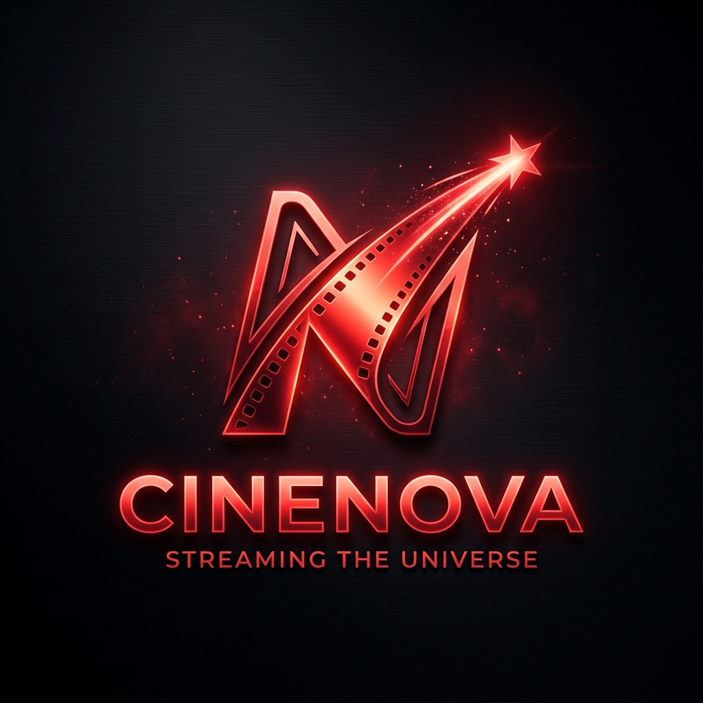

# 🎬 NetMovies - Premium Movie Recommendation App

NetMovies is a high-end, self-contained movie recommendation platform built with **Streamlit** and **Scikit-Learn**. It provides a cinematic experience with content-based filtering, allowing users to discover movies based on plot keywords, genres, and metadata without needing any external API keys.



## ✨ Features
- **Premium UI**: Dark mode, gold accents, and glassmorphism effects for a "Netflix-like" feel.
- **Content-Based Filtering**: TF-IDF vectorization on plot keywords, genres, directors, and actors.
- **Weighted Recommendations**: Smart scoring that considers similarity, IMDb ratings, and release year.
- **Interactive Search**: Real-time search with visual feedback.
- **Watchlist**: Personal session-based watchlist to track movies you want to see.
- **Responsive Design**: Clean layout that works on different screen sizes.
- **No API Keys**: Fully local execution using the IMDb-5000 dataset.

## 🛠️ Tech Stack
- **Frontend**: Streamlit + Custom HTML/CSS
- **Machine Learning**: Scikit-Learn (TF-IDF, Cosine Similarity)
- **Data Handling**: Pandas, Numpy
- **Assets**: Custom generated logos and CSS-based poster placeholders

## 🚀 Getting Started

### 1. Clone the repository
```bash
git clone <your-repo-link>
cd netmovies_proj
```

### 2. Install Dependencies
```bash
pip install -r requirements.txt
```

### 3. Run the App
```bash
streamlit run app.py
```

## 📂 Project Structure
- `app.py`: The main Streamlit interface and UI logic.
- `recommendation_engine.py`: ML logic for similarity calculation and ranking.
- `data_preprocessing.py`: Script to clean and prepare the raw IMDb dataset.
- `dataset/`: Contains the raw and processed movie metadata.
- `assets/`: UI assets like the logo.

## ☁️ Deployment

### Streamlit Cloud (Recommended)
1. Push this folder to a GitHub repository.
2. Connect your GitHub account to [Streamlit Cloud](https://share.streamlit.io/).
3. Select the repository and `app.py` as the main file.
4. Click **Deploy**.

### Hugging Face Spaces
1. Create a new Space with the **Streamlit** SDK.
2. Upload all files (including the `dataset/` folder).
3. The app will build and run automatically.

## 📝 Notes
- The app automatically processes the dataset on the first run.
- Poster placeholders are generated dynamically using CSS gradients and movie initials to ensure privacy and local reliability.

---
Built with ❤️ by Antigravity
